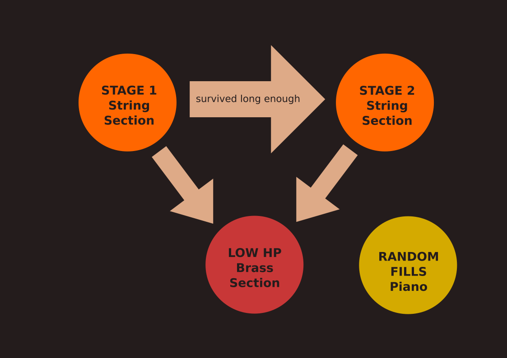
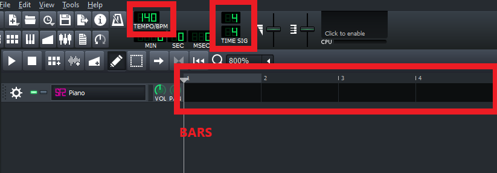
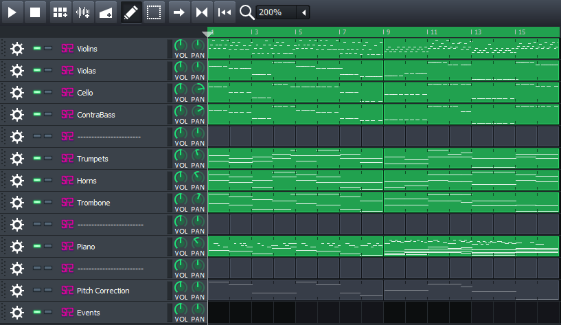

# Godot Dynamic Music Framework
## What is this?
It is a Godot plugin for dynamic music. It was designed to add dynamics to the game soundtrack. If you're looking for a tool that can mix and blend between track depending on the in-game variables, I got you. If you're looking for a tool that can play musical motifs randomly in the track, I got you. If you need a way to sync your game with the music in the background without headaches, I got you. 

What does the workflow look like? Open your favourite DAW. Make your music. Export your tracks and midi's to your project's asset directory. Use the Playlist Generator to quickly and intuitively organize your audio in a way the plugin will understand. Organize your sound buses. Wire up your scripts to the `MusicController`'s signals. And bada-bing bada-boom, all is good.

## Usage
There is quite a bit to go through so the usage will be explained through an example; a real-life use case for this plugin. I will also try to fit as many images as posible for better viewing experience.

### Act I - Before I forget
Before we start, we need to figure out what we want. For this example, I wish to make a simple bullet-hell game in which attacks syncronize with music. 

So what do we need for this. What game states exist that the music will highlight. Lets start simple, low HP. Something happens to the music when player gets hurt. This implies that there is certain music playing when player is ok. Further more, since I am a lazy dev, lets make it so that when the player survives for long enough the music shifts to something more upbeat. Like a stage two of a boss fight.

So that makes four states. Stage I, Stage II, Stage I low HP, and Stage II low HP. In this composition, lets have a string section and a brass section. The string section will be fast, while the brass section will be slow and grand. Idea is to make the music (and consequently the attacks) fast when Player's HP is high, and slow when Player's HP is low. And maybe we'll add a piano for some random fills to keep the music interesting.





### Act II - Beeps and Boops
Now its time to actually write the music. Open up your favourite DAW, and/or get ready to record. I will use LMMS.

There is a couple things to keep track of for future refference; BPM, Time Signature, and Bar numbers. BPM and time signature will give the plugin the length of a bar. This is important because the plugin figures out what to play, and when to play it depending on which bar it's in.




I have gone ahead and made a little composition for the demo. The composition looks like this, with Brass and Strings "./Example/SongSnippets/StringsAndBrass.mp3", and piano sounding like "./Example/SongSnippets/Piano.mp3)". 



So what is going on here. As planned, we have three instrumental sections: the **Strings**(Violins, Violas, Cellos, and Contrabass'), the **Brass**(Trumpets, Horns, and Trombones), and the **Piano**. The **strings** are playing in a fast rhytmic staccato, while the **brass** plays long, majestic, legato. Finally we have the **piano** to add a bit of randomness and interest to these 16 bars. Finally, if you look closely, there is a Pitch Correction, and an Events instrument at the bottom; this will become important later.

So, what did I take into consideration when making this track. 
#### Horizontal Mixing
Horizontal mixing is simple. It assumes that your music is divided into sections. You just have to make sure that whatever comes *after* your section, fits well with the *end* of your section. In the example, the first eight bars work well regardless of if they [loop to the begining](), or move on to the [next eight bars](). 

When working on your music, you aim to make the jumps between sections as unnoticable as posible. This will mostly depend on the melody, rhythm, and chord progression. The length of your section will play the part as well: a stutter every 4 bars is far more noticable than the stutter that occurs once every 16 bars. This will come at the cost of music's adaptability, since it will take it a while longer to get to the end of a section where the jump occurs, but it wouldn't matter much for more environmental music. 

Another thing that will help mask the jump is reverb. **DO NOT APPLY IT IN YOUR DAW!** Its better to let Godot handle the reverb. This is because the plugin simply plays a file. When a jump occurs it just moves to another place in that file. It ignores everything after it, including the tail of the reverb. Then the stututer becomes even more obvious: not only does the music change, but the reverb dissapears as well. Letting Godot handle the reverb fixes this issue.

#### Vertical Mixing
Vertical mixing doesn't jump between tracks like horizontal mixing, but rather, it blends between them. The tracks play at the same time, but at different volumes. Imagine you were playing two recordings on two phones. One phone plays the piano part, and the other plays the violin part for the same song. If both recordings are in sync, you can mix between them by turning the volume of the phones up or down. First only the piano plays. Then you gently turn up the violin part, and now they blend into eachother. This is vertical mixing.

So what do you need to keep track of? Firstly, you must divide the sounds playing at the same time into sections(again). We already did this for this example, remember: **Brass**, **Strings**, and **Piano**; **Strings** on high HP, and **brass** on low HP. Next, you must make them sound good. Both together, and apart. 

You can get really creative with it, making one track plays the chord progression, and the other play a melody that clashes with the harmony, creating quite a dissonant sound. Curious mixture that could fade in as the monster approaches, if you were making a horror game. 

#### Embelishments
To make your music more dynamic, you can add some randomness to it. Oneshots, as I call them. Little musical motifs which sometimes play... and sometimes don't. Even a looping 4 chord progression can sound godly if there is a good solo floating above it. What I call "Oneshots" is what Mick Gordon used on his Doom OST. Making a few riffs which would play randomly throught the song.
Just add some simple motif's, embelishments, or odd notes. Do try to make them sound good with whatever is in the background, but also plan for their uncertain nature.

#### Pitch Correction
This has nothing to do with the DAW itself. Think back to games like Abzu, or Journey, where each sound effect plays like an instrument, adding a bit of harmonic, and melodic complexity. Now, you could chose to make your game's sound effects meldical when making them, but maybe you wish to make them melodical retroactivly. In comes pitch correction. To be precise, it is just a midi file. And in this midi file, there is **only a melody** i.e. **only one note** is being pressed at a time. When the plugin reads this file, it will attempt to pitch shift every sound connected to a certain audio bus in Godot.

#### Events
Up till this point we have only looked at ways to make the music addapt to the gameplay, but now we shall take a look at a way for the music to influence the gameplay.

Imagine a piano keyboard. Say that every time the pianist presses the E4 key, there is a certain behaviour in-game. That is the idea of the event track. It is a MIDI track whose notes respond to a behaviour in-game. If it wasn't obvious, this track is inaudible. You can use it to sync events in game with the background music, if not letting the midi track completely puppeteer the enemy AI. It should ideally be only a melody, but there exists an oportunity for randomness. If you have two notes at the same time, you could make it a fifty-fifty chance for either behaviour. But if one note is louder, then the odds are stacked in it's favour. This is what we will use for the behaviour in game.

#### Exporting
When exporting, make sure you have each track exported separately, either in **.wav**, **.ogg**, or **.mp3** format. Keep in mind that **.wav** is not compressed i.e. takes up a lot more space. Conversely, **.ogg** and **.mp3** take up less space, but they do take up extra processing for uncompressing during runtime. In general, a short sound that has to be played a lot benefits from **.wav**, like the sound of footsteps, and the longer sounds benefit from **.mp3**, or **.ogg**.

**Double-check your MIDI files!** I don't know how it is for other DAWs, but LMMS exports all midi tracks as a single file; ALL OF THEM. So do double-check your midi's in your DAW, just to make sure that the MusicController is playing the right thing. **I have no idea how else you would notice where the problem is in-game. Mayhaps, wiring signals to a function which prints out all notes pressed? Regardless, you have been warned.** 

### Act III - Organizing the goods
Music being done. Now is the time to organize the sounds in a way the plugin will understand. Open an empty scene, and add a `DMFPlaylistGenerator` to it. While reading this, I recommend going through `res://Example/PLAYLIST_GENERATOR.tscn` scene. All nodes explained below are used there, and correspond to the example music used here. 


#### PlaylistGenerator
`DMFPlaylistGenerator` is made up of many smaller nodes which simplify the organization of all the files, and settings. At the top of all the nodes is the `DMFPlaylistGenerator` node aka. the Generator. If you select it, you will see that this node has a singular property: toggle. When pressed, it will generate `res://Library.gd` file. Second is the `DMFSong` node. This node defines all the songs available to the `MusicController`. Here you will define the song's BPM and its Time Signature. 

The organisation of nodes should look like this: 
```
Generator ---------(DMFPlaylistGenerator)
\--Song -----------(DMFSong)
   \-- Tracks -----(DMFTrack)
   \-- Segments ---(DMFSegment)
   \-- Transition -(DMFTransition)
   \-- Oneshots ---(DMFOneshot)
   \-- Watchdogs --(DMFWatchDog)
   \-- Midi's -----(DMFMidiPlayer)
   
```

FYI: You can add as many songs as you wish, as long as the song nodes are under the generator node. Likewise you can add as many Tracks, Segments, ..., Midi's as you want, but they must always be under the Song node. Now that the structure is in place these are the nodes you'll be working with. Most of the organization is abstract, so I've provided a sketch of what is actually happening.


#### Tracks
Firstly, the node you'll spend most of your time with: `DMFTrack` node. It's job is to play a sound file; simple as. The only thing you need to figure out is what bar it should start at, and how many bars it should last for. You can look back at your DAW to see what these values will be. 

#### Segments
Next up is the `DMFSegment` node. This is what will be responsible for horizontal mixing. Specify FROM which TO which bar a segment will span. Be sure to use unique names for the segment nodes, because those names will be how the `MusicControler` will recognize which segment to play.
 
#### Oneshots
`DMFOneshot` nodes have a certain chance of playing any time the song loops back to them. You only need to specify on which bar it should trigger, and what is the chance of it playing.

#### Watchdogs
`DMFWatchdog` is where things get crazy. The gist of it is: you select a track, one of ITS properties, one of the WORLD's properties, WORLD property's max value, and a graph of how it should respond. Imagine it this way: The game starts and you have this piano track playing. The player gets hit, and the health drops bellow 50%. Along with it, the piano gets quieter, and a violin fades in. How? Watchdogs. You start with two tracks: the piano and the violin. Then you make two watchdogs. You make one watchdog target the piano track, and the other one target the violin track. You tell them their `Current Property` is "PlayerHP", and that the `Property Max` is "PlayerHPMax"(both of which must be available in the Blackboard), and to `Change Property` Volume. Lastly, you create the new curves for the `Change Graph`. One whose value is high above 50%, and one whose value is high BELOW 50%. That is how you get the example above. 

#### Midi's
And then there is the `DMFMidi` node, intended to syncronize the music and the bahaviour in-game. Say, in a guitar hero like game, you could map the RED button to note C2, BLUE button to note D2, and the YELLOW button to note E2. The `MusicController` will process this midi file alongside the track file, and emit signals when a note is on, and when its off. Since the `MusicController` is a singleton, you can connect any object to it by simply writing `MusicController.connect("note_on", self, "_on_Node_note_on")`, and `MusicController.connect("note_off", self, "_on_Node_note_off")`(This assumes that you know how connecting signals works). There is no end to what you can do with this functionality.

### Act IV - The Conductor
* how to set up your scene(bus layout)
* wiring up the signals

## TO DO
These are some of the things that will probably interupt my game development.
- ~Get rid of the `Library.gd` and replace it with `Library.tres`. Far more efficient.~
- ~Add transitions. There is currently no way to hop between segments, or songs.~
- Give Watchdogs more properties they can influence e.g. Filters, Panning, Overdrive, Flanger, etc.
